RAAD Executable Installer for Windows 10 x86_64
################################################
If it is your first time utilizing RAAD, please follow the instructions below to download and execute the required files to start developing or utilizing RAAD. There are two sections in this article:
    - one for developers.
    - one for users of RAAD.

The section for developers is directly below. The section for users can be found after the section for developers. Please note the tutorial is for Windows, the tutorial for Ubuntu/Linux will be uploaded at a later iteration of the project.

Information for Developers of RAAD:
    - As a developer you need to download the installation wizard found in the RAAD under "RAAD Executables": The wizard is named installer.exe. Once you have downloaded the file from teams, please follow the instructions below. @todo jdtarang

Instructions for the installation wizard:
*****************************************
After the download is done, run the executable. You may encounter a blue window telling you "Windows protected your PC".

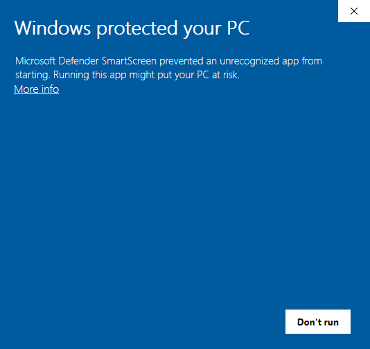

Click on "More info" and then on the new button "Run Anyway".

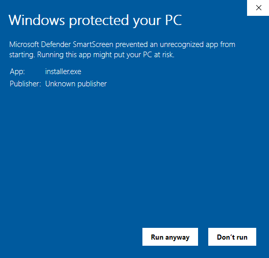

Once the executable is running, you should see a background terminal window with all the warning and info statements for the wizard executable. If the executable runs correctly, a window like the one shown below should pop-up on top of the terminal window. Select "Yes" on the first drop down menu (as the wizard is being run directly from the executable), and continue with the other steps.

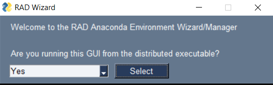

    Note: Make sure you click on "Select" so that the GUI registers the option chosen in the drop down menu.

After you have accessed the second screen, install Anaconda by choosing the "install" option from the drop down menu and clicking the "Execute" button shown below. The Anaconda executable will be downloaded and the installer will be launched. Accept the terms and conditions and don't change any of the options while installing anaconda (click on next until you reach the installation). Wait for the installation to finish and then return to RAAD installation Wizard

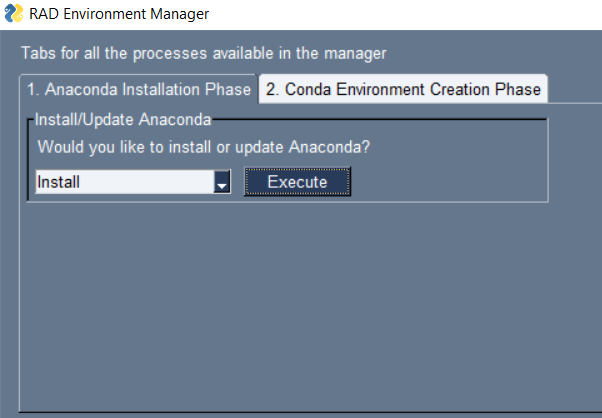

    Note: If for some reason you already had Anaconda installed in your device, you can update it to the latest version by choosing the "update" option in the drop down menu and clicking the "Execute" button shown below.

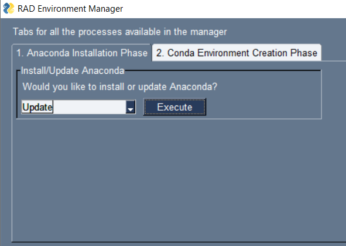

    Note: If the wizard starts crashing before Anaconda gets updated/installed, please check your connection to the internet and try again. If the problem persists, please manually download anaconda by going to https://www.anaconda.com/products/individual

Download the environment configuration file found here: environment_win-x86_64.yml

After the file has been download into your local machine, click on the tab titled "2. Conda Environment Creation Phase" to change to the next tab and start the environment creation process. The tab looks like the one displayed below

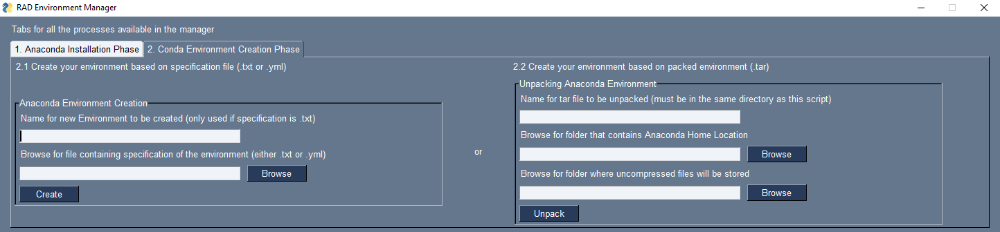

Once you are in the "Conda Environment Creation Phase" tab, use the "Anaconda Environment Creation" tool to create the environment using the .yml that you downloaded in step 3. To create the environment, you need to click on the "Browse" button, which will display a navigator window as shown below. Use this navigation window to locate your copy of "environment_win32.yml" and click the open button to insert the path in the input line.

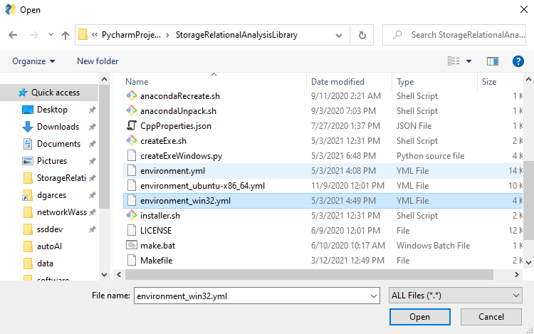

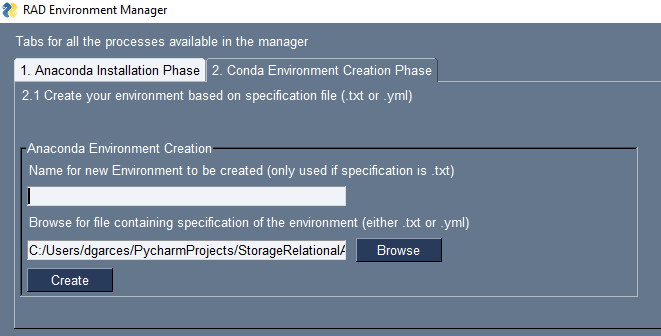

Once the path is in the input line, click on the create button and wait for the process to finish. If the environment was created successfully, a success message like the one displayed below will be shown in the background terminal window.

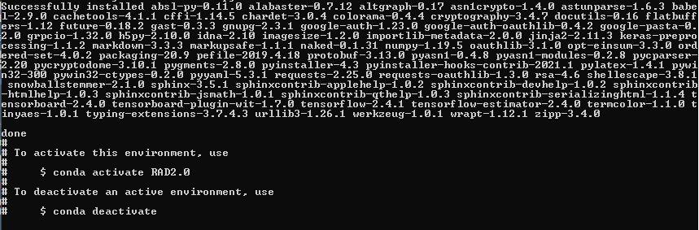

    Note: The main wizard GUI will be frozen while this process executes. Look at the background terminal window to check for progress, but do not close the wizard window as this will terminate the process and might affect future installation attempts.

If you find a proxy error, please follow the following instructions, which are based on the initial solution proposed by Joe Tarango here:
- Look for env in your search bar near the lower left of your screen. Go to "Edit the System Environment Variables" as shown below.

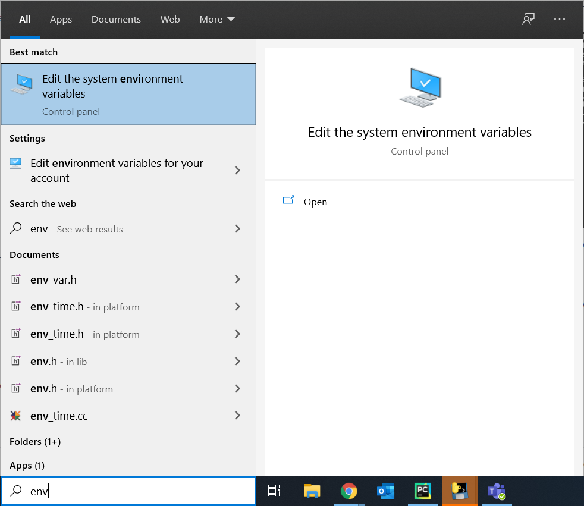

- Once this configuration opens, click "Yes" on the pop-up window.

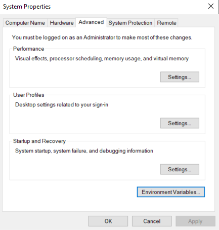

- Click on "Environment Variables" as shown below.

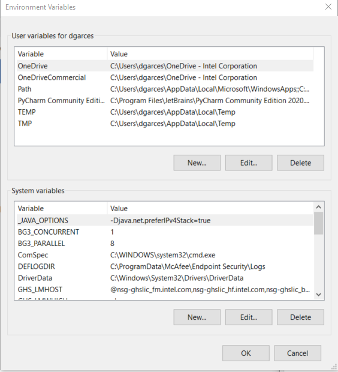

- Click on the "New..." button for System variables and then add the following 3 variables as shown in the pictures below. Please consider that the examples below are for configuring the proxy with the US network. Change your configuration accordingly to reflect the location of the proxy that you want to utilize. Please refer to the code below for the easy cut and paste variable values.

.. code-block:: console

        HTTPS_PROXY
        https://proxy-chain.com:2
        NO_PROXY
        localhost,192.168.0.0/16,172.16.0.0/12,127.0.0.0/8,10.0.0.0/8
        HTTP_PROXY
        http://proxy-chain.com:1

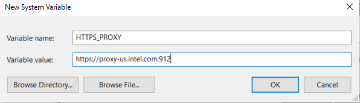

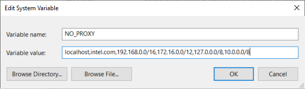

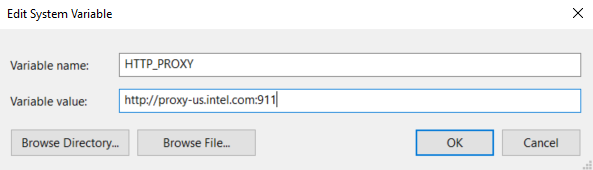

- Open an Anaconda3 Prompt (it should have been installed during the Anaconda installation), and type: where .condarc.

.. figure:: images/GS016.png

        Note:  If there is no .condarc, please create this file inside C:\Users\<your-user>\, where <your-user> corresponds to the user name that you are utilizing on your local machine.

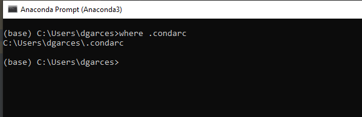

- Navigate to the file location and open the file with your editor of choice (emac, vim, notepad++, etc). Modify your file to resemble the file shown below.

.. code-block:: console

        channels:
          - conda-forge
          - defaults
          - intel
          - pytorch
          - anaconda
          - bioconda
          - mkl

        ssl_verify: true
        allow_other_channels: true

        # Proxy settings: http://[username]:[password]@[server]:[port]
        proxy_servers:
        http: http://proxy-chain.com:1
        https: https://proxy-chain.com:2

        # Implies always using the --yes option whenever asked to proceed
        always_yes: true

        # Auto updating of dependencies
        update_dependencies: true

        # Environment variables to add configuration to control the number of threads. Choose for you machine.
        default_threads: 4

        # Update conda automatically
        auto_update_conda: true

        # Enable certain features to be tracked by default.
        track_features:
        - mkl

        # pip_interop_enabled (bool)
        #   Allow the conda solver to interact with non-conda-installed python packages.
        pip_interop_enabled: true

        # Show channel URLs when displaying what is going to be downloaded.
        show_channel_urls: true

        #   Opt in, or opt out, of automatic error reporting to core maintainers.
        #   Error reports are anonymous, with only the error stack trace and information given by `conda info` being sent.
        report_errors: false

- If you don't have it installed, please install the C++ Redistributable included in the Visual Studio 2019, which can be found here: https://visualstudio.microsoft.com/downloads/. After the download and the installation. Close all the installers and restart your computer. After your computer reboots, open the RAAD installation wizard again and try the environment creation againy.

- If the issues persist, uninstall anaconda by following the instructions in https://docs.anaconda.com/anaconda/install/uninstall/, kill the RAAD installation Wizard and start again from step 1.

- If you face additional issues with anaconda not described in this tutorial, please use the following list to manually install the packages in the conda prompt. Navigate to Anaconda Prompt and execute each of the following commands independently. Wait for the command to complete its execution before running the next command

.. code-block:: console

    conda create --name raad python=3.8
    conda activate raad
    conda uninstall pip
    conda install pip=20.2.4=py38_0
    conda install wgetter
    conda install pandas=1.0.5
    conda install -c conda-forge scikit-learn
    conda install statsmodels
    conda install -c anaconda psutil
    conda install -c conda-forge gputil
    conda install -c anaconda cryptography
    conda install -c anaconda pycrypto
    conda install -c anaconda urllib3
    conda install -c conda-forge atlassian-python-api
    conda install -c conda-forge jira
    conda install -c conda-forge pyinstaller
    pip install matplotlib==3.3.1
    pip install tensorflow==2.3.0
    pip install gnupg
    pip install PyLaTeX
    pip install tinyaes
    pip install PySimpleGUI
    pip install tornado
    pip install pycairo
    pip install unidecode
    pip install sentence-transformers

- After the creation of the environment finishes, you need to clone the RAAD repository by using git. If you do not have git, please go here to download it. Open a git terminal (as shown below), and execute the following command:

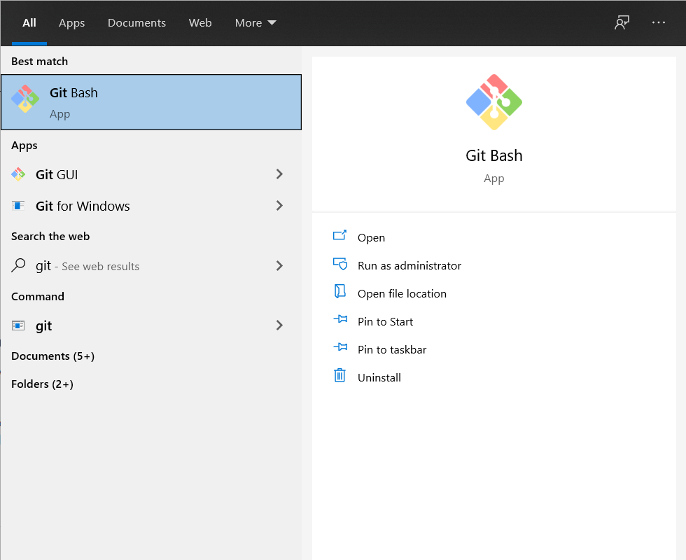

.. code-block::

        git clone https://github.com/Intel/RAAD.git

- After the repo has been cloned, close the installation wizard and the git bash terminal. Open an Anaconda3 Prompt (it should have been installed during the Anaconda installation) and activate the environment by executing conda activate RAAD2.0

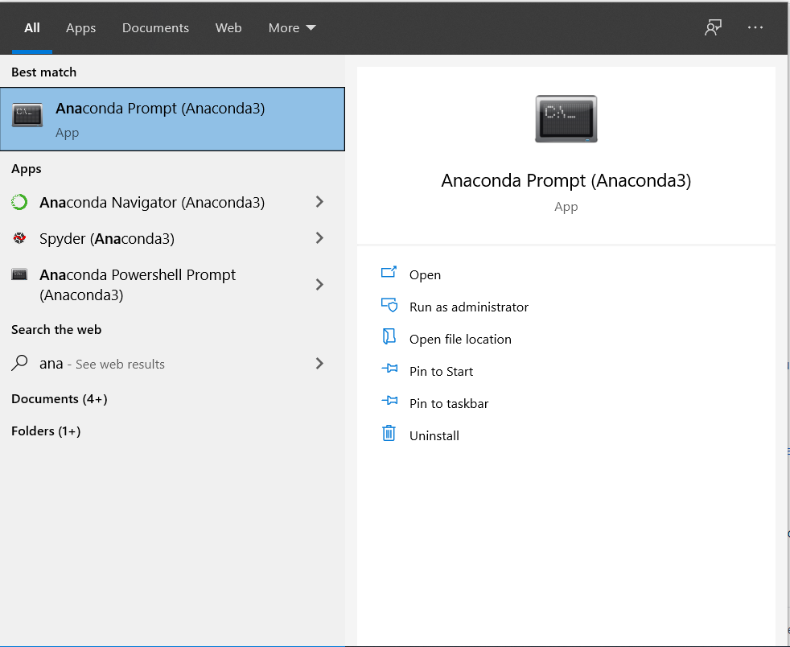

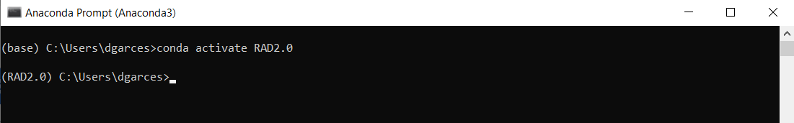

- Use the anaconda prompt to navigate to the location of the recently cloned "RAAD" repo and start developing using emac, vim, or your IDE of choice (I personally recommend PyCharm, which has a ton of useful features for developing in Python). If you decide to use PyCharm, you might need to open the repo using their interface, so it is properly initialized as a PyCharm project and you can use the embedded terminal for git and executing your scripts.

- If you want to easily manage your environments, navigate inside the repo to src/ and then run the installer GUI by utilizing the following command once you are inside src:  python installer.py

    .. figure:: images/GS022.png

    - Select "No" in the first window for the installation wizard

    .. figure:: images/GS023.png

    - utilize the other miscellaneous functionalities that we have included to facilitate environment management for RAAD.

    .. figure:: images/GS024.png

Information for Users of RAAD
*****************************
As an user of RAAD, you need to access the GUI to run the functionality of our system,. There are two choices for running the GUI:

    - Follow the instructions for developers all the way to steps above. Once you have a copy of the repo in your machine, run the main.py script by executing the following command from Anaconda3 prompt (with the right environment activated), or from your IDE of choice (as long as you are using the right environment for the interpreter) - please remember that you need to navigate to src/ before running the command: python main.py --mode 1

        - After around 30 seconds of automatic set-up, the system will generate a window like the one displayed below. Follow the subsection "Instructions for the GUI" for more information on how to operate the GUI.

        .. figure:: images/GS025.png

    - Create or use the GUI executable. @todo jdtarang folder inside the RAAD teams channel:  The GUI is named gui.exe. Once you have the executable and its accompanying folder, make sure you save them both to the same location in your machine to allow the executable to operate correctly. The software file should contain a single file (the logo for the GUI), please make sure the logo is directly inside "software" and not nested inside other folders. To open and run the executable, just double-click on it.

        - You may encounter a blue window telling you "Windows protected your PC". Click on "More info" and then on the new button "Run Anyway"

        .. figure:: images/GS026.png

        - Follow the subsection "Instructions for the GUI" for more information on how to operate the GUI.

        .. figure:: images/GS027.png

            Note: Method 1 is preferable to guarantee that you get all the latest changes and recent code pushes that are constantly being added to the repo to improve the system functionality; however, method 2 provides a stable baseline with the basic functionality at the time of writing.
